# Real-Time Piano Note Recognition System 🎹

**Author:** Nir Cohen  
**Role:** Electrical Engineering Student @ Tel Aviv University  
**Focus Areas:** Signal Processing • Embedded Systems • Harmonic Analysis • Algorithms • Digital Logic

---

## Project Overview
This project implements a **real-time piano note recognition system** on an **Arduino microcontroller** using a microphone input.  
The system applies **Fast Fourier Transform (FFT)** and **harmonic analysis** to detect fundamental frequencies and identify piano notes in real time.  
Recognized notes are transmitted over **I²C** to a second Arduino, which can play back or process the sequence.

This project demonstrates:
- **DSP skills** – FFT, harmonic detection, noise rejection.  
- **Embedded systems** – interrupt-driven ADC sampling, timer configuration, hardware-level optimization.  
- **Algorithms** – decision logic for note recognition, error minimization using harmonic matching.  
- **Digital logic** – direct register manipulation for ADC and timers (no reliance on Arduino delay functions).  
- **System integration** – real-time recognition and communication across microcontrollers.  

---

## Key Features
- **Real-time sampling**:  
  - ADC configured via registers for deterministic sampling.  
  - Timer1 interrupts for precise control at ~7.2 kHz.  

- **FFT-based frequency analysis**:  
  - `arduinoFFT` library used to compute spectra from sampled audio.  
  - DC removal + Hamming window for cleaner spectral output.  

- **Harmonic detection algorithm**:  
  - Identifies peaks in the FFT magnitude spectrum.  
  - Matches peaks against a set of target piano note frequencies (`C4 – B4`).  
  - Uses squared error minimization across harmonics to select the best candidate note.  

- **Robust recognition logic**:  
  - Noise rejection via amplitude thresholds.  
  - Timeout-based resets for incomplete sequences.  
  - Tolerance to repeated notes (counts length of sustained notes).  

- **Sequence verification**:  
  - Compares recognized sequence against a predefined **correct melody**.  
  - Success and failure patterns transmitted via I²C to a secondary device.  

---

## 📐 System Architecture

```mermaid
flowchart LR
    subgraph input[Signal Input]
        mic[Microphone]
    end

    subgraph preprocessing[Preprocessing]
        adc[Arduino ADC + Timer ISR]
    end

    subgraph dsp[DSP Core]
        fft[FFT + Harmonic Analysis]
    end

    subgraph logic[Recognition Logic]
        recog[Note Recognition State Machine]
    end

    subgraph output[Output / Integration]
        i2c[I²C Transmission]
        playback[Secondary Arduino Playback]
    end

    mic --> adc --> fft --> recog --> i2c --> playback
```

* **Signal Input:** Microphone at analog pin A0.
* **Preprocessing:** Interrupt-driven ADC sampling at fixed rate.
* **DSP Core:** FFT + harmonic matching.
* **Recognition:** State machine for storing and validating notes.
* **Output:** Sequence sent via I²C bus.

---

## 🚀 Technical Highlights

* **Sampling Frequency:** 7.272 kHz
* **FFT Size:** 128 samples
* **Recognized Notes:** 7 notes (`C4, D4, E4, F4, G4, A4, B4`)
* **Sequence Length:** 7 notes with timeout handling
* **Embedded Techniques:**

  * Direct register access (`ADMUX`, `ADCSRA`, `TCCR1A/B`)
  * Interrupt-driven sampling & processing
  * Memory-optimized arrays for FFT buffers

---

## 📂 Source Code

The full implementation is available here:
👉 [View Code](../piano-recognition.ino)

Key sections include:

* `ISR(ADC_vect)` – handles real-time ADC sampling.
* `computeFFT()` – applies FFT and computes magnitudes.
* `decideFrequency()` – harmonic matching algorithm.
* `allNotesPlayed()` – sequence validation and result handling.

---

## Takeaways

* Ability to **bridge theory and practice** in DSP and embedded systems.
* Comfort with **low-level hardware programming** (beyond Arduino abstractions).
* Strong foundation in **signal processing, algorithms, and system design**.
* Hands-on experience integrating **real-time embedded logic** with hardware interfaces.

---

## Skills Demonstrated

* **DSP:** FFT, windowing, harmonic peak detection, noise filtering.
* **Embedded Systems:** ISR design, real-time sampling, hardware register configuration.
* **Algorithms:** Error minimization, decision logic, state machines.
* **Communication Protocols:** I²C for multi-device integration.

---

## 📊 Academic Impact

This project received a **grade of 100** in the **Hardware Lab course** and reflects my interest in **signal processing, control, and embedded systems**.

---

