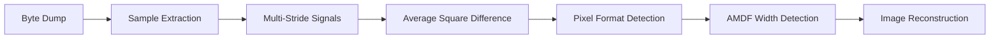

# Raw Image Decoder via Blind Signal Analysis

[View on GitHub](https://github.com/NirC1/STRIDE-raw-image-decoder)

---

## Overview

A tool for recovering images from raw byte dumps without prior knowledge of format, dimensions, or headers. This project started when I encountered an unknown byte dump file and decided to use the statistical structure of image data to blindly reconstruct it.

The approach uses signal processing techniques in two stages:
1. **Pixel Structure Detection** — analyze byte patterns to determine pixel format (grayscale, RGB, RGBA, bit depth, endianness)
2. **Width Detection** — find the image width by detecting periodicity in the byte signal

---

## Architecture

---

## Method

### Stage 1: Pixel Structure Detection

From a sample of the byte data, we construct multiple signals — each with a different stride (1–6 bytes) and offset. For each signal, we calculate the **Average Square Difference**:

$$\text{ASD} = \frac{1}{N} \sum_{i=0}^{N-1} (a_{i+1} - a_i)^2$$

This metric measures signal smoothness. In image data, the most significant byte of each pixel (e.g., the R channel in RGB) tends to change gradually between adjacent pixels. Signals sampled at the correct stride and offset will be smoother than others.

By comparing ASD values across all stride/offset combinations, we can infer:
- **Pixel stride**: 1 (grayscale), 2 (gray+alpha), 3 (RGB), 4 (RGBA), 6 (RGB 16-bit)
- **Byte order**: which offsets contain significant vs. alpha/padding bytes
- **Endianness**: for 16-bit formats, whether data is little or big endian

### Stage 2: Width Detection

Once we identify the pixel format, we extract the signal corresponding to a significant byte channel. We then apply the **Average Magnitude Difference Function (AMDF)**:

$$\text{AMDF}(\tau) = \frac{1}{N} \sum_{i=0}^{N-1} |a_i - a_{i+\tau}|$$

The AMDF finds periodicity in the signal. Since image rows repeat every `width` pixels, the AMDF shows a clear minimum at the lag corresponding to the image width.

---

## Result

With the pixel format and width determined, the image dimensions are computed (height = total pixels / width), and the image is reconstructed:

---

## Technical Details

|---|---|
| **Algorithm** | Average Square Difference + AMDF |
| **Supported Formats** | GRAY_8, GRAY_ALPHA_8, RGB_8, RGBA_8, RGB_16_LE, RGB_16_BE |
| **Stack** | C (main tool), Python/Jupyter (exploration) |

---

## Code

[GitHub repository](https://github.com/NirC1/STRIDE-raw-image-decoder)

| Module | Role |
|---|---|
| `main.c` | CLI entry point and output handling |
| `stride_pipeline.c` | Core algorithms: stride analysis, format detection, AMDF, reconstruction |
| `stride_pipeline.h` | Library API |
| `decode-image.ipynb` | Jupyter notebook for exploration and visualization |

---
