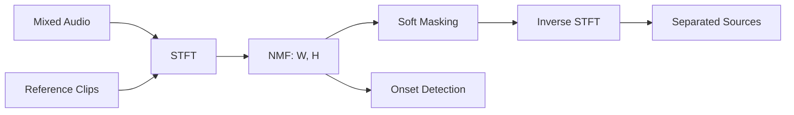

# Audio Source Separation via NMF

Nir Cohen | Electrical Engineering, Tel Aviv University

---

## Overview

A Python system for separating mixed audio into individual sources using Non-Negative Matrix Factorization. Given a mixed recording (e.g. a drum loop or noisy speech), the system recovers the individual components by factorizing the magnitude spectrogram.

Three methods are implemented, each building on the last:

- **Blind NMF** -- factorizes V into W and H with no prior knowledge. Components are assigned to sources after the fact via spectral correlation.
- **Informed NMF** -- pre-learns spectral dictionaries from short isolated recordings, then solves only for activations on the mixture.
- **Joint Learning** -- concatenates reference clips alongside the mixture and applies block-diagonal constraints on H, letting the dictionaries adapt while staying anchored to the references.

The joint method also supports speech denoising (given a noise reference) and onset detection as a by-product of the activation matrix.

---

## Architecture

Mixed audio and optional reference clips are transformed via STFT into magnitude spectrograms. NMF decomposes the spectrogram into spectral dictionaries (W) and activations (H). Soft masks derived from W and H are applied to the mixture STFT, and inverse STFT recovers the separated waveforms.

---

## Technical Details

| | |
|---|---|
| **Algorithm** | Multiplicative update rules, Frobenius cost |
| **Normalization** | W columns unit-normed (l2), H counter-scaled |
| **Stack** | Python 3.10+, numpy, librosa, scipy, matplotlib, soundfile |
| **Applications** | Drum separation (kick/snare/hihat), speech denoising, onset detection |

---

## Code

[GitHub repository](https://github.com/NirC1/source-separaion-NMF)

| Module | Role |
|---|---|
| `core.py` | NMF algorithms |
| `separation.py` | Joint separation, masking, source selection |
| `visualization.py` | Spectrograms, onset plots, comparisons |
| `utils.py` | Audio I/O, STFT |
| `cli.py` | CLI for drum separation and speech denoising |

---
